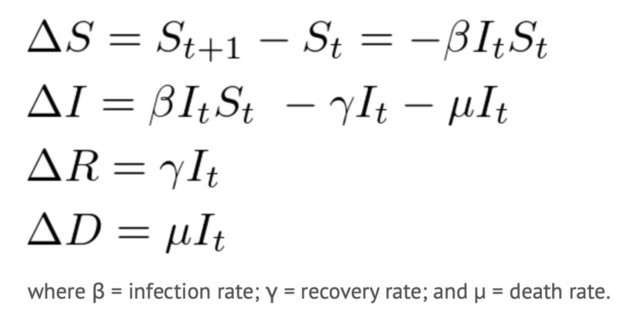
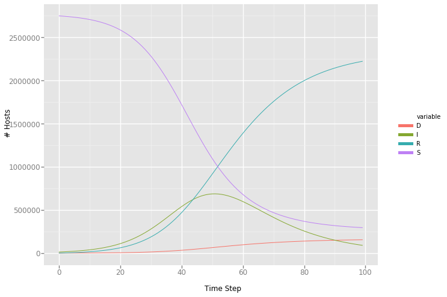

#Sample SIRD Model


**<p style="text-align: center;">

</p>**


##Import the Libraries
```python
#Import the libraries
from functools import reduce
from typing import Tuple, Dict, Any
import pandas as pd
import streamlit as st
import numpy as np
import altair as alt
import matplotlib.pyplot as plt
from math import floor
from ggplot import *
```

##Parameters
```python
#Hospital Parameters

# Miami Dade County Population
S_default = 2761581.0

# Hospital Market Share
Penn_market_share = 1.0

# Currently Hospitalised Patients (at current hospital?)
known_cases = 636.0
current_hosp = known_cases

# Currently Hospitalised Patients
known_infections = 1000.0
initial_infections = known_infections

# Doubling Time
doubling_time = 6.0

# Social Distancing (% reduction in social contact)
relative_contact_rate = 0.0
```

##Severity Parameters
```python
#Severity Parameters

# Hospitalisation (% of total infections)
hosp_rate = 0.05

# ICU (% of total infections)
icu_rate = 0.02

# Ventilated (% of total infections)
vent_rate = 0.01

# Infectious Days
recovery_days = 14.0

# Average hospital length of stay (days)
hosp_los = 7.0

# Average ICU length of stay (days)
icu_los = 9.0

# Average length of stay on a ventilator (days)
vent_los = 10.0
```

##Detection
```python
# Total Infections without accounting for undetected
total_infections = current_hosp / Penn_market_share / hosp_rate
print(total_infections)

#Detection probabiltiy
detection_prob = initial_infections / total_infections
print(detection_prob)

#Accounting for Detection
Infct = initial_infections / detection_prob
Susc, Infct, Recov = S_default - Infct, Infct, 0.0

total_dead= 354
print(total_dead)


```

    12720.0
    0.07861635220125786
    354


```python
#Estimate of Total Infected Accounting for Detection Probability
print(Infct)

#Estimate of Total Infected minus deaths
Infct2 = Infct- total_dead
print (Infct2)

```

    12720.0
    12366.0


```python
#Estmate of Total Succeptible
print(Susc)

#adjust for deaths
Susc2= Susc- total_dead
print(Susc2)
```

    2748861.0
    2748507.0


```python
# Intrinsic Growth
intrinsic_growth_rate = 2 ** (1 / doubling_time) - 1
print(intrinsic_growth_rate)
```

    0.12246204830937302


## SIR Transition Rates
```python
#SIR Transition Rates
type(Recov)
print(Recov)

#Gamma = Recovery Rate
gamma = 1.0 / recovery_days
#mean recovery rate, gamma, (in 1/days).
print(gamma)


#Beta = Infection Rate
beta = (intrinsic_growth_rate + gamma) / Susc * (1.0 - relative_contact_rate)
# Contact rate, beta
# {rate based on doubling time} / {initial Susc}
print(beta)

#Mu = Death Rate 
total_deaths = 63
mu= total_deaths / Infct
print(mu)
```

    0.0
    0.07142857142857142
    7.05348941754219e-08
    0.004952830188679245


```python
# Reproduction Number
r_t = beta / gamma * Susc 
# Current Reproduction Number
# r_t is r_0 after distancing
print(r_t)

#Reproductive Number Accounting for Contact
r_naught = r_t / (1.0 - relative_contact_rate)
# Initial Reproduction Number
print(r_naught)
```

    2.7144686763312222
    2.7144686763312222


```python
# Doubling Time
doubling_time_t = 1.0 / np.log2(beta * Susc - gamma + 1.0) 
# Current Doubling Time
# doubling time after distancing
print(doubling_time_t)

# type(Recov)
```

    5.999999999999998


## The Model
```python
#Running the Model
#Initializing Vars
S = 2748861.0
I = 12720.0
R = 0
D = 354
steps = 100
#Disease Parameters
beta = 7.05348941754219e-08
gamma = 0.07142857142857142
mu = 0.004952830188679245
history = pd.DataFrame({"S": S, "I": I, "R": R, "D": D}, index=[0])
#Run sim loop
history["step"] = history.index
plotData = pd.melt(history, id_vars=["step"])
ggplot(plotData, aes(x="step", y="value", color="variable"))+geom_line()
for step in range(1, steps):
    newInf = floor(min(max(beta*I*S, 0), S))
    newRec = floor(min(max(gamma*I, 0), I))
    newDead = floor(min(max(mu*I, 0), I-newRec))
    S = S - newInf
    I = I + newInf - newRec - newDead
    R = R + newRec
    D = D + newDead
    history = history.append(pd.DataFrame({"S": S, "I": I, "R": R, "D": D}, index=[step]))
history["step"] = history.index
#Plot using Python port of ggplot
plotData = pd.melt(history, id_vars=["step"], value_vars=["S","I","R","D"])
ggplot(plotData, aes(x="step", y="value", color="variable"))+geom_line()+xlab("Time Step")+ylab("# Hosts")
```

##Model Output



   


```python

```
SIRD model for Covid-19 in Miami-Dade County. The code is avaiable for private useage. The social distancing parameter is set to 0 and can be altered. The model will be updated as deaths and recovery information is made available.