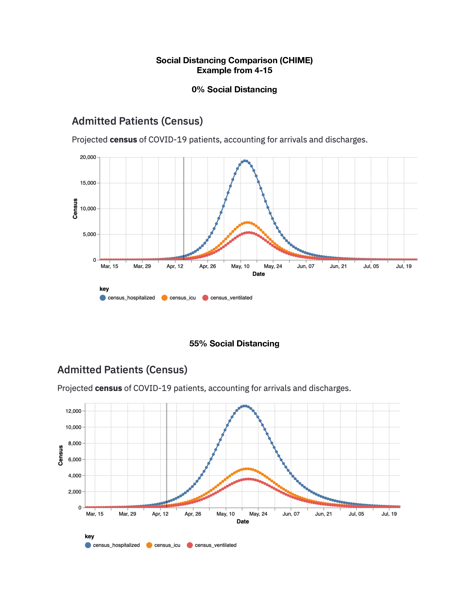

# FAQ

Commonly asked questions

##If there is so much uncertainty with these models, what good are they?
The models provide predictions about the timing of the COVID-19 epidemic and the maximum number of people who may need hospitalization, need intensive care unit care and need ventilation. This information can be used to help community leaders and medical facilities prepare. The models also help us to see the impact of different interventions. For example, we can see how increasing social distancing can reduce the maximum number of people who may need ventilation or delay the peak demand timing of it; thus allowing our health care system to keep up with the community needs. Similarly, they provide information about what may happen as we begin to relax social distancing.  

##When will the epidemic peak for Miami-Dade County?
The two models have different projections for the epidemic peak with the CHIME model showing a later prediction of the peak demand than the IHME model. Either of these predictions are possible or the peak may be in the middle. It is also possible that there may be a second peak if social distancing does not occur for a long enough time period. Only a small percentage of the population of South Florida has been infected with COVID-19. Everyone else remains susceptible to the virus.

##When can we go back to work?
Both models were developed to help health care systems anticipate the number of people who will need to hospitalization, intensive care unit care, and ventilation.  They can also provide estimations of what would happen if we relax social distancing, but policy makers will need to decide how and when to reduce social distancing.  

##Why do we need to social distancing?
Because very few people have been infected with COVID-19 in Miami-Dade County so far, most people are susceptible to the virus. The only way to prevent transmission is to avoid contact with other people. Therefore, people are being asked to stay at home except for essential activities; non-essential businesses are closed; and schools are closed. If people practice strict social distancing consistently, then the number of people who are infected will decrease. This will decrease the number of people who will need to be hospitalized per day, the number of people needing intensive care unit care per day, and the number of people needing ventilators. It these numbers can be kept low enough, area hospitals and health care workers will be able to care for those needing this essential care. The figures below show two scenarios. One is Miami-Dade County if there is no social distancing. The other is Miami-Dade County with 50% social distancing (that is, if everyone is following the guidelines from the Mayor of Miami-Dade County).

###Social Distancing- With and Without 
**

**

Based on the CHIME Model, through social distancing, we can reduce the expected number of hospital beds needed at the peak from 19,285 to 12,622. We can reduce the expected number of ICU beds needed at the peak from 7,280 to 4,817. We can reduce the expected number of ventilators needed at peak the from 5,306 to 3,549. Furthermore, we can delay the peak of the epidemic from May 8th until May 18th. Note: This is just an example projection to illustrate the power of social distancing.

##What are the differences between the models?
The University of Washington’s Institute of Health Metrics and Evaluation (IHME) model uses historical data on the course of changes in rates of death principally from outbreaks in other countries such as China and Italy to predict how many deaths will occur in the future. The advantage of the model is that we have much better data about the current number of deaths than we do about the number of infections although it is still likely that some deaths are not correctly attributed to COVID-19, resulting in undercounts. The disadvantage of the model is that it assumes that our experience will be similar to that seen historically in other countries. The IHME Model assumes 0.3% of the population will be exposed and assumes that social distancing continues until June 1st. Institute for Health Metrics and Evaluation. IHME COVID-19 Model FAQ’s. Available [here.](http://www.healthdata.org/covid/faqs#differences%20in%20modeling)

Penn Medicine’s COVID-19 Hospital Impact Model (CHIME) model is based on the SIR (susceptible-infected-recovered) Model.  The SIR Model says at any time people in the population are susceptible to (not yet immune), infected with, or recovered from the disease. CHIME uses the SIR model to project the number of new hospitalizations over time. A disadvantage of the model is that it assumes that people mix uniformly within a population. To obtain local projections, the number of local hospitalizations is needed as well as the date of the first COVID-19 hospitalization. Hospitalization data is more likely to be accurate than the number of COVID-19 infections; however, the diagnosis of some people who are hospitalized with COVID-19 may be delayed for several days due to testing delays. These people would not show up as being hospitalized for COVID-19 until their test result is confirmed. CHIME model information can be found [here.](https://code-for-philly.gitbook.io/chime/what-is-chime/sir-modeling)
